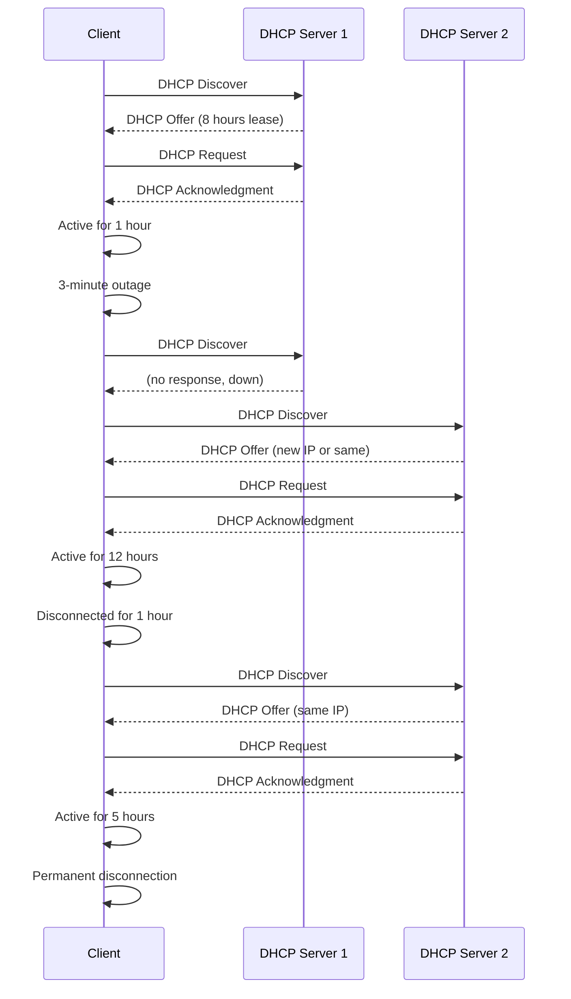

```mermaid
sequenceDiagram
    participant C as Client
    participant S1 as DHCP Server 1
    participant S2 as DHCP Server 2

    C->>S1: DHCP Discover
    S1-->>C: DHCP Offer (8 hours lease)
    C->>S1: DHCP Request
    S1-->>C: DHCP Acknowledgment

    C->>C: Active for 1 hour

    C->>C: 3-minute outage

    C->>S1: DHCP Discover
    S1-->>C: (no response, down)
    C->>S2: DHCP Discover
    S2-->>C: DHCP Offer (new IP or same)
    C->>S2: DHCP Request
    S2-->>C: DHCP Acknowledgment

    C->>C: Active for 12 hours

    C->>C: Disconnected for 1 hour

    C->>S2: DHCP Discover
    S2-->>C: DHCP Offer (same IP)
    C->>S2: DHCP Request
    S2-->>C: DHCP Acknowledgment

    C->>C: Active for 5 hours

    C->>C: Permanent disconnection
```
